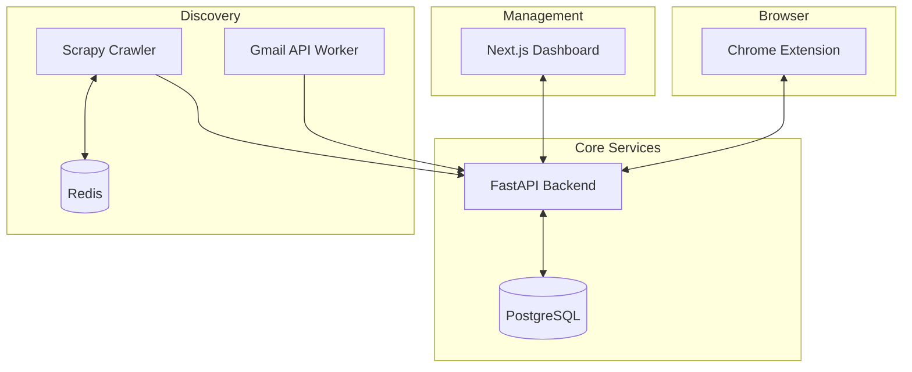

# CATA: AI-Powered Job Application Automation

[](https://github.com/peroperje/cata)
[](LICENSE)

CATA (Chrome Assistant for Tailored Applications) is an end-to-end platform designed to automate the heavy lifting of job searching. By combining a browser extension for intelligent form-filling with a centralized management dashboard and automated job discovery services, CATA turns a manual process into a streamlined pipeline.

---

## ✨ Key Features

- **🤖 Intelligent Autofill**: Chrome Extension (Manifest V3) that uses AI (Gemini, OpenAI, Groq) to contextually fill application forms using your CV data.
- **📊 Unified Dashboard**: A Next.js 15+ management interface for tracking applications, managing CVs, and filtering discovered jobs.
- **📩 Gmail Extraction**: Background service that polls your inbox for job alerts from LinkedIn, Indeed, and glassdoor, extracting metadata automatically.
- **🕷️ Smart Scraper**: Scrapy-based crawler that uses NLP (spaCy) to rank web-based job postings against your specific professional profile.
- **📄 Pro CV Management**: Upload and parse multiple PDF CVs. Swap between different professional versions for specialized roles seamlessly.
- **🏗️ Scalable Architecture**: Built as an Nx Monorepo for consistent development, testing, and deployment across all services.

---

## 🛠️ Tech Stack

### Frontend & UI
- **Extension**: React + Vite + TypeScript (CRXJS)
- **Dashboard**: Next.js 15 (App Router) + Tailwind CSS + Lucide Icons
- **Shared UI**: Centralized component library for design consistency

### Backend & AI
- **API**: FastAPI (Python 3.12) + SQLAlchemy + Pydantic
- **Database**: PostgreSQL (Persistent storage)
- **AI Engine**: Unified AI Factory supporting Google Gemini, OpenAI, and Hugging Face
- **Automation**: Scrapy (Crawling) + Redis (Queue/Orchestration)

---

## 🚀 Quick Start

### 1. Prerequisites
- **Node.js**: 18.x or higher
- **Python**: 3.11+ (with `venv` support)
- **Docker**: For full-stack orchestration (Recommended)
- **API Keys**: Google Gemini or OpenAI key

### 2. Initial Setup
```bash
# Clone the repository
git clone git@github.com:peroperje/cata.git
cd cata

# Install workspace dependencies
npm install

# Setup local environment
cp .env.example .env
```

### 3. Service Commands
Use Nx to run individual services or Docker for the full stack:

| Task | Command | Environment |
| :--- | :--- | :--- |
| **Full Stack** | `docker compose up --build` | Docker |
| **Dashboard** | `npx nx run dashboard:dev` | Local |
| **API** | `npx nx run api:serve` | Local |
| **Extension** | `npx nx run extension:dev` | Local |

### 4. Gmail API Authentication
1. Place your `credentials.json` from Google Cloud Console in `apps/gmail-api/`.
2. Run the `gmail-api` service; it will initiate an OAuth2 flow on the first run.

---

## 🏗️ Architecture Overview

Cata follows a distributed architecture coordinated by an Nx workspace:



### Repository Structure
- `apps/extension`: The browser-based interface for form filling.
- `apps/dashboard`: The central command center for job tracking.
- `apps/api`: Central FastAPI server handling CV parsing and data persistence.
- `apps/gmail-api`: Polling service for email-based job extraction.
- `apps/scraper`: Python-based web discovery engine.
- `libs/`: Shared TypeScript models and React components.

---

## 📡 Core API Reference

The backend provides a versioned REST API. Documentation is available at `/docs` when the API is running.

| Endpoint | Method | Description |
| :--- | :--- | :--- |
| `/api/v1/cvs` | `GET/POST` | Manage professional CV metadata and files. |
| `/api/v1/jobs` | `GET` | List all discovered jobs (Gmail + Scraper). |
| `/api/v1/process` | `POST` | Trigger AI form-filling logic for a specific job. |
| `/api/v1/status` | `GET` | Health check for all connected services. |

---

## 🧪 Testing

```bash
# Run all workspace tests
npx nx run-many -t test

# Test specific project
npx nx run api:test
```

---

## 📄 License

This is a private project for personal use. All rights reserved.
